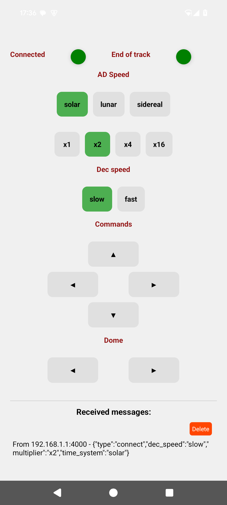

# jonckheere_remote_control
Remote control for the Jonckheere refractor (From Lille observatory)

The goal is to develop an wireless remote command of the mount of the Jonckheere refractor. A esp32 micro controller will manage the motor's drivers of the mount, and another ESP32 will manage all the buttons to pilot it.

.jpeg>)

.jpg>)

All the communication between the ERP32 are using UDP protocol to ensure fast response. 
For the development purpose, an Android application has been also developped using react native.

.jpg>)

## Receptor

The receiver is directly connected to the stepper motor drivers of the mount. It consists of an ESP32 and an SI5351, which provides highly precise pulses to the drivers to ensure accurate sidereal, solar, or lunar tracking.

It also includes a frequency divider, as the SI5351 cannot generate the low frequencies required, along with transistors to interface with the drivers.

The ESP32 creates a Wi-Fi network that clients use to send commands.

.jpg>)

## Remote Control

The remote control consists of just an ESP32 and a 74HC165 shift register, which avoids using all of the ESP32's GPIO pins for wiring the buttons.

The ESP32 scans the 74HC165 and checks for any state changes, then sends commands accordingly.

.jpg>)

## Mobile App

While we were at it, a mobile app was developed in React Native to control the telescope via a smartphone...

